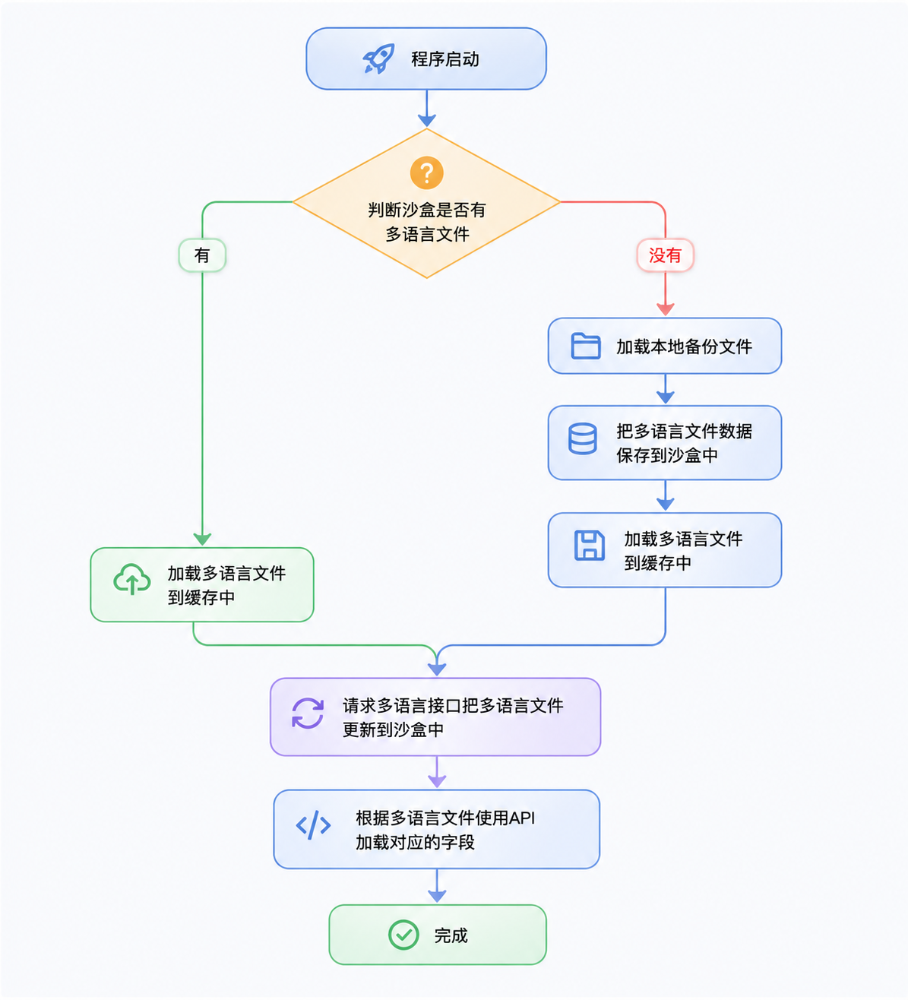
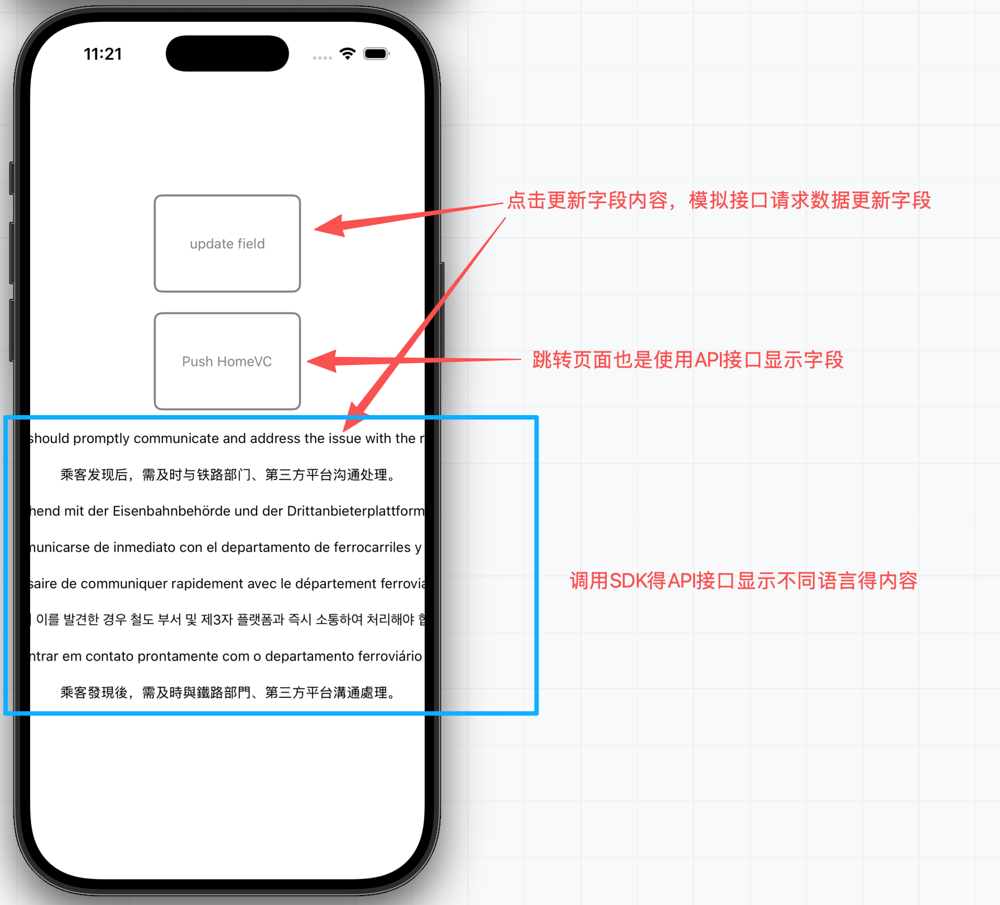
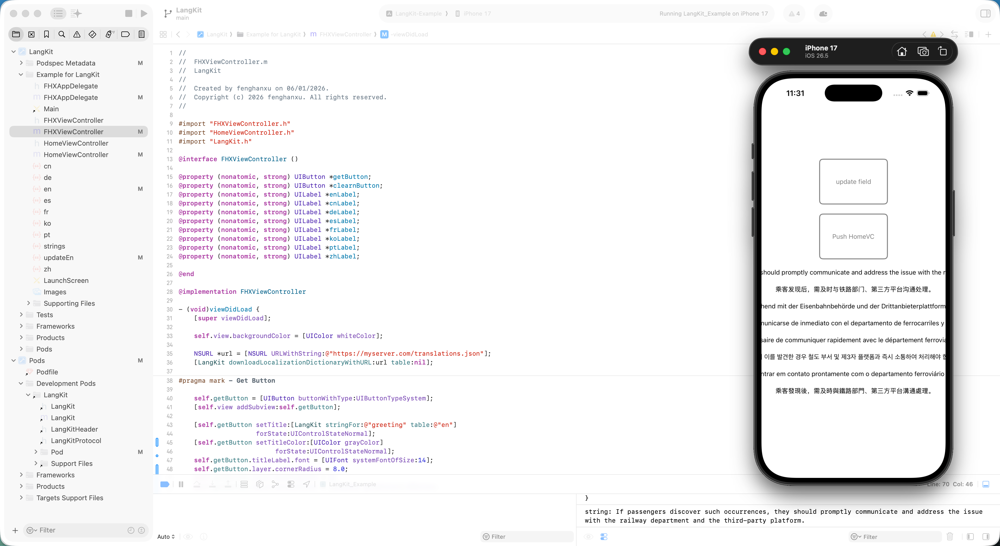

# LangKit
# ✨ Explanation — 说明

支持国际化(多语言)线上第三方

某些公司希望App支持的多语言文件放到线上,通过下载多语言文件的方式或者通过接口请求json数据回来,进行多语言显示的方式,解决多语言的问题.

## 线上多语言方向的优劣

能解决的问题

1.如果字段的内容是由不同不部门或者受到区域限制的问题,可能放到线上,其他人修改比较方便
2.如果发现内容有问题,需要及时更改及时使用,需要等待审核这段时间.

不能解决的问题

另外.其实多语言弄到线上去,最大的一个帮助就是,更新内容的时候,直接可以热更新,不需要重新提交审核,其实并不能完全很好的解决全部问题,
1.主要是app有新的页面(功能)开发,就需要有新增的字段,也是需要重新提交审核.(只能解决原有的字段内容更新)
2.如果从线上下载多语言的字段,为了防止下载失败,通常都会在项目放入一份多语言的json文件进行备份.而且要跟线上的保持一致.如果是这样的话,线上的那份就多此一举了.本地本身有一份跟线上的一模一样,就没有必要从网上拿,如果本地不备份存在安全隐患,万一接口访问失败,整个app有很大的影响

# ⚙️ How It Works -- 工作原理

原理类似于SDWebimage


<p align="center">
  
</p>


1.程序启动：系统启动时，首先进行初始化操作。
2.检查沙盒中的多语言文件：系统判断沙盒（应用的本地存储空间）中是否已经存在多语言文件。
- 如果存在：
  - 直接加载沙盒中的多语言文件到缓存中，为后续调用做准备。
- 如果不存在：
  - 系统加载本地的备份多语言文件。
  - 将备份文件的数据保存到沙盒中。
  - 然后将这些多语言文件加载到缓存中。

3.更新多语言文件：无论是从沙盒直接加载，还是通过备份文件加载，系统都会向多语言接口请求最新的多语言文件，并将更新后的数据写入沙盒中。
4.使用多语言文件：系统根据多语言文件的内容，通过 API 加载对应的文本字段，实现多语言显示。
5.完成初始化：所有多语言文件加载和更新完成后，系统进入正常运行状态。


---------------------------


简而言之，这个逻辑确保了应用启动时：

- 优先使用沙盒中已有的多语言文件以加快启动速度；
- 若没有，则使用本地备份文件初始化；
- 然后再请求最新的多语言数据更新沙盒；
- 最终通过缓存和 API 提供多语言显示功能。


# 📸 Preview — 预览

<p align="center">
  
</p>


# 📦 Installation -- 安装

```ruby
pod 'LangKit'
```

# 🚀 Usage — 使用

直接下载Demol,Demol包含使用方法和第三方的代码，可以直接运行

<p align="center">
  
</p>

 下面是开发中使用到的常用方法，使用下面这些方法，就能满足需求

1.判断沙盒是否存在中文文件，如果没有读取回来的数据是空

```ruby
 if (![LangKit localizationDictionaryForTable:@"en"]) {}
```

2.读取项目本地备份导入的中文文件

```ruby
NSData *enData = [NSData dataWithContentsOfFile:[[NSBundle mainBundle] pathForResource:@"en" ofType:@"json"]];
NSDictionary *enJson = [NSJSONSerialization JSONObjectWithData:enData options:NSJSONReadingMutableContainers error:nil];
[LangKit setMainLocalizationDictionary:enJson table:@"en" update:NO storeOnDisk:YES];
```

3.使用公司提供的URL地址，下载语言文档，保存在到沙盒中

```ruby
NSURL *url = [NSURL URLWithString:@"https://myserver.com/translations.json"];
[LangKit downloadLocalizationDictionaryWithURL:url table:nil];
```
4.链接中的json文件要求是下面的格式

```ruby
{
  "greeting": "近日，记者就此事询问了12306平台及第三方购票平台，证实类似情况确有可能发生。",
  "message": "乘客发现后，需及时与铁路部门、第三方平台沟通处理。"
}
```

字段Api,一个是字段参数，另一个是选择语言
```ruby
[LangKit stringFor:@"greeting" table:@"en"]
```


