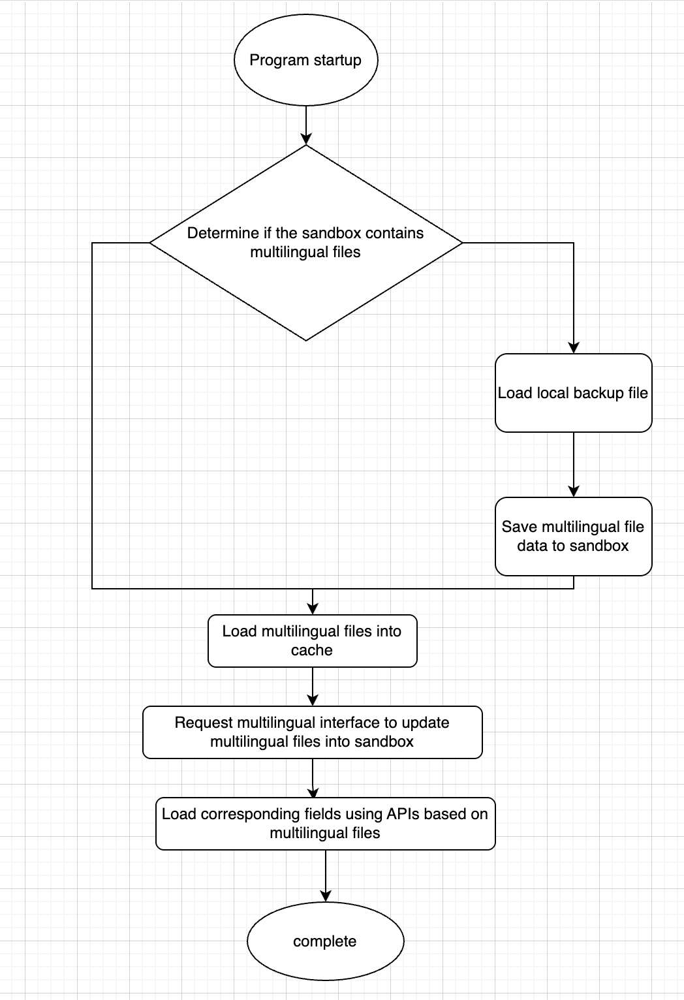
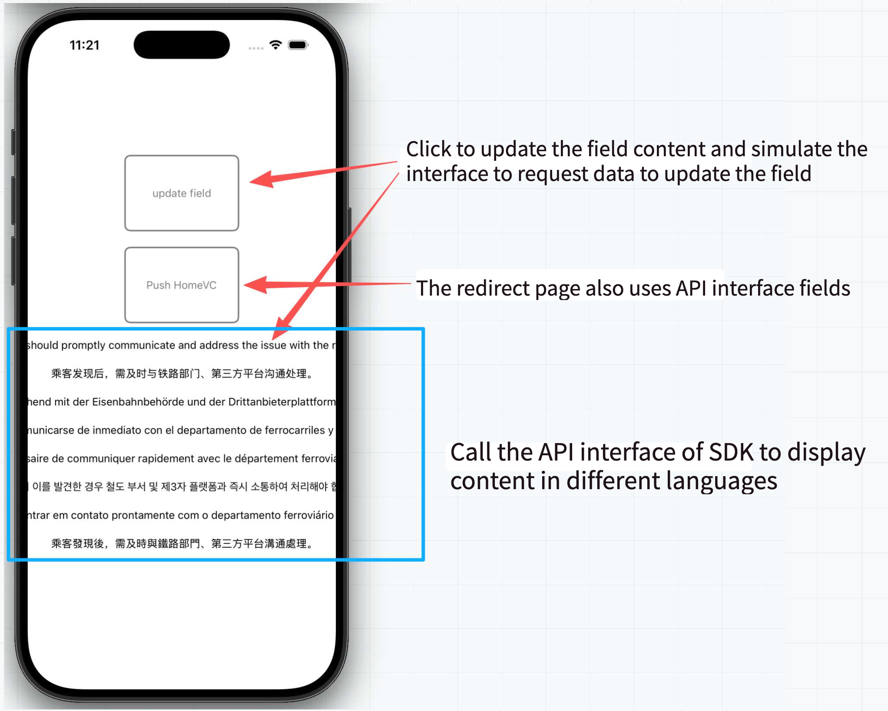

# LangKit

[中文文档](README_CN.md)

[英文文档](README.md)

## Explanation

LangKit is an online localization (multi-language) solution for iOS applications.

In some projects, localization files are not bundled entirely within the app. Instead, language resources can be hosted on a remote server and downloaded dynamically, or fetched through an API that returns JSON data. This approach allows applications to update translations without releasing a new version of the app.

------

## Pros and Cons of Online Localization

### Advantages

Online localization can help solve the following problems:

1. Translation content can be managed by different teams or departments without requiring a new app release.
2. If a translation contains mistakes or outdated content, it can be updated immediately without waiting for App Store review approval.

### Limitations

Although online localization provides the ability to update translation content remotely, it does not solve every localization-related issue.

1. When new pages or features are added to the application, new localization keys are usually required. These changes still require a new app release and App Store review.
2. To avoid issues caused by network failures, most applications keep a local backup of the localization files. This backup should remain synchronized with the server version. In practice, this means the app already contains a complete set of localization resources, making the remote copy partially redundant. Without a local backup, failed downloads or API outages could significantly impact the user experience.

------

# How It Works

The workflow is conceptually similar to SDWebImage.

<p align="center">
  
</p>


### Startup Process

1. **Application Launch**

   When the application starts, LangKit performs its initialization process.

2. **Check Localization Files in the Sandbox**

   LangKit checks whether localization files already exist in the application's sandbox storage.

   - If localization files exist:
     - Load the files directly from the sandbox into memory cache.
   - If localization files do not exist:
     - Load the bundled backup localization files.
     - Save the backup files to the sandbox.
     - Load the localization data into memory cache.

3. **Update Localization Files**

   Regardless of whether the data comes from the sandbox or the bundled backup, LangKit requests the latest localization files from the server and updates the sandbox storage.

4. **Provide Localized Strings**

   The application retrieves localized text through LangKit APIs based on the selected language and localization keys.

5. **Initialization Complete**

   Once localization data has been loaded and updated, the application continues normal operation.

------

### Summary

In short, LangKit follows this strategy:

- Use existing sandbox files whenever possible for faster startup.
- Fall back to bundled backup files if sandbox files are unavailable.
- Fetch the latest translations from the server in the background.
- Store updated translations locally.
- Provide localized strings through a simple API interface.

------

# Preview

<p align="center">
  
</p>


------

# Installation

```
pod 'LangKit'

```

------

# Usage

Download the Demo project included in this repository. It contains complete examples and source code demonstrating how to integrate and use LangKit.

<p align="center">
  
</p>


The following APIs cover most common localization scenarios.

### 1. Check Whether a Localization File Exists

Returns an empty result if the specified language file does not exist.

```
if (![LangKit localizationDictionaryForTable:@"en"]) {
    
}

```

------

### 2. Load a Local Backup Localization File

```
NSData *enData = [NSData dataWithContentsOfFile:[[NSBundle mainBundle] pathForResource:@"en" ofType:@"json"]];

NSDictionary *enJson = [NSJSONSerialization JSONObjectWithData:enData
                                                       options:NSJSONReadingMutableContainers
                                                         error:nil];

[LangKit setMainLocalizationDictionary:enJson
                                 table:@"en"
                                update:NO
                           storeOnDisk:YES];

```

------

### 3. Download Localization Files from a Remote Server

```
NSURL *url = [NSURL URLWithString:@"https://myserver.com/translations.json"];

[LangKit downloadLocalizationDictionaryWithURL:url table:nil];

```

------

### 4. JSON Format Requirements

The downloaded localization file should follow this format:

```
{
  "greeting": "Recently, reporters contacted the 12306 platform and third-party ticketing platforms, confirming that such situations may indeed occur.",
  "message": "Passengers should promptly communicate with railway authorities and third-party platforms for assistance."
}

```

------

### 5. Retrieve a Localized String

The first parameter is the localization key, and the second parameter specifies the language table.

```
[LangKit stringFor:@"greeting" table:@"en"];

```

------


[中文文档](README_CN.md)

[英文文档](README.md)